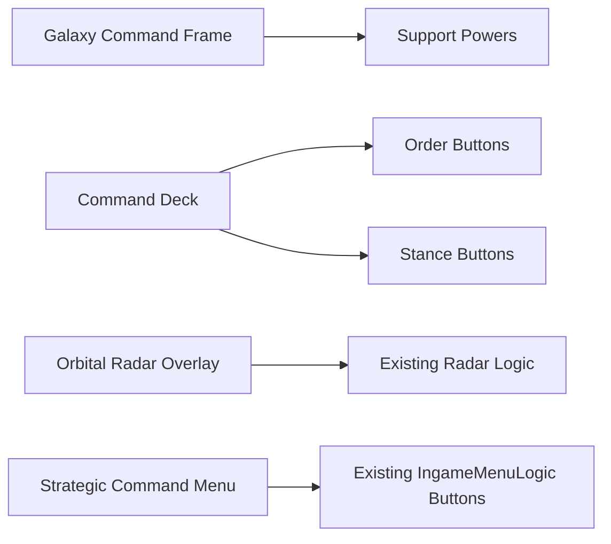

# In-Game UI Redesign Pass

This pass applies the OGame 0.84 inspired epic-blue interface language to the active Red Alert in-game chrome while keeping OpenRA's existing command, sidebar, radar, production, and menu logic intact.

## Files Updated

- `mods/ra/chrome/ingame-player.yaml`
- `mods/common/chrome/ingame-menu.yaml`

## Style Targets

- Stellaris-style command surfaces: dark translucent panels, bright blue accent rails, compact all-caps headers.
- OGame 0.84 browser-game palette: deep navy backgrounds, pale blue text, sector-grid labels, orbital/radar language.
- RTS/4X/MMORPG menu model: the menu labels use galaxy, system, planet, fleet, diplomacy, and character categories as the strategic layer vocabulary.

## HUD Panels

## Current Scope

The redesign is visual chrome only. It does not yet replace OpenRA production logic with OGame planet pages, fleet pages, resource pages, alliance pages, or MMORPG character sheets. Those systems remain documented in the OGame scaffold and can be wired into later UI screens once gameplay backing data exists.

## Next Integration Targets

- Add clickable top-level strategic tabs once screen logic exists for galaxy, planet, fleet, diplomacy, and character pages.
- Add resource-band widgets for metal, crystal, deuterium, energy, credits, supply, and command capacity.
- Add a 4X empire overview panel that reads from the `OpenRA.Mods.Common.OGame084` catalog and economy models.
- Extend observer chrome to share the same visual language.
