# OGame 0.84 UML

These diagrams are Mermaid UML/flow diagrams derived from `ogamespec/ogame-opensource/game`.

## Request Routing

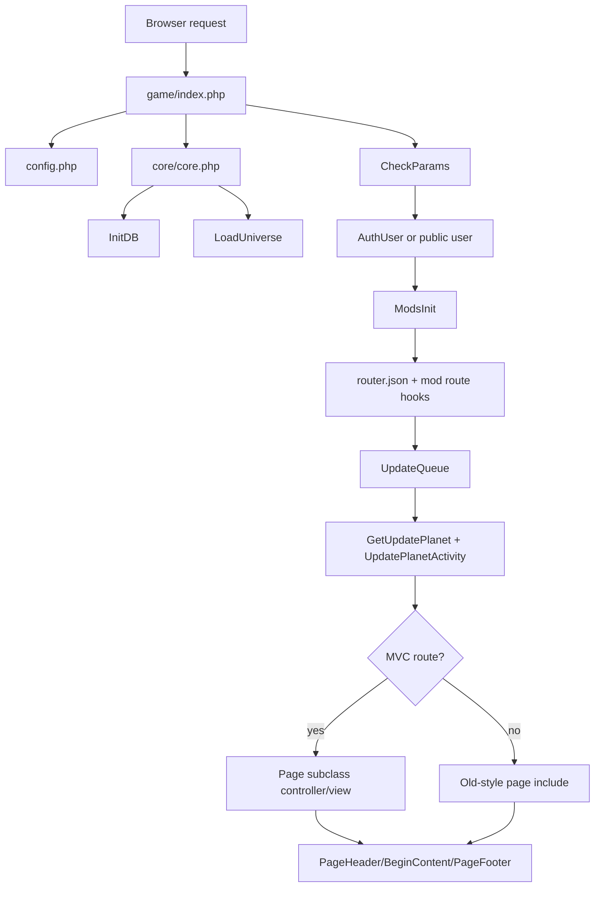

## Core Package Map

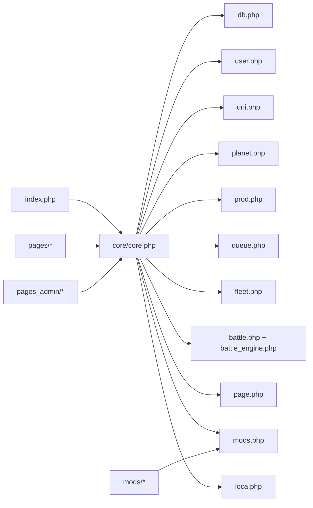

## Page and Mod Classes

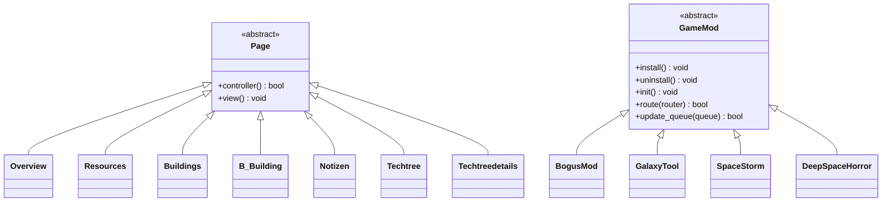

## Queue System

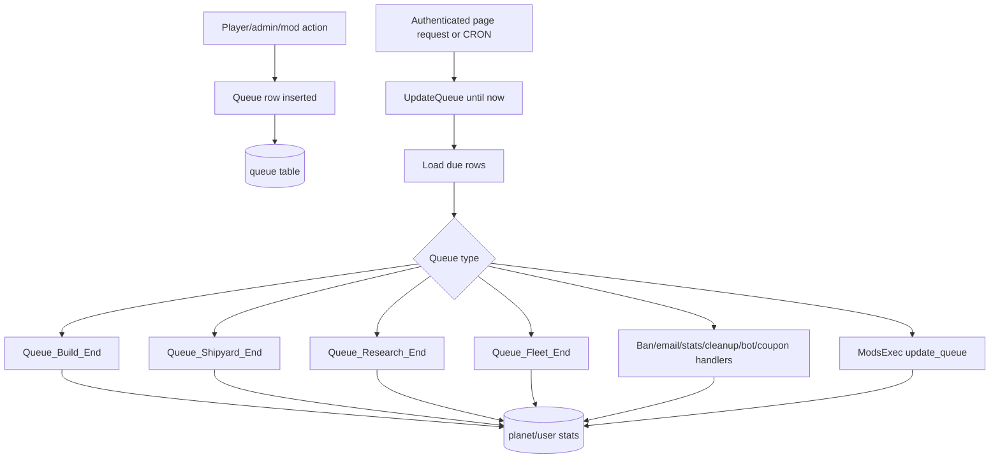

## Fleet Mission Logic

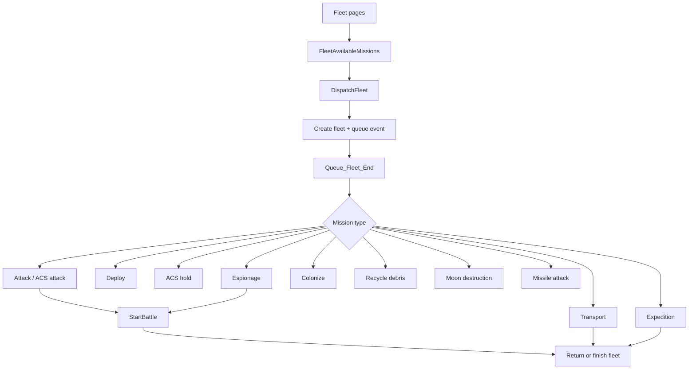

## Battle Simulation

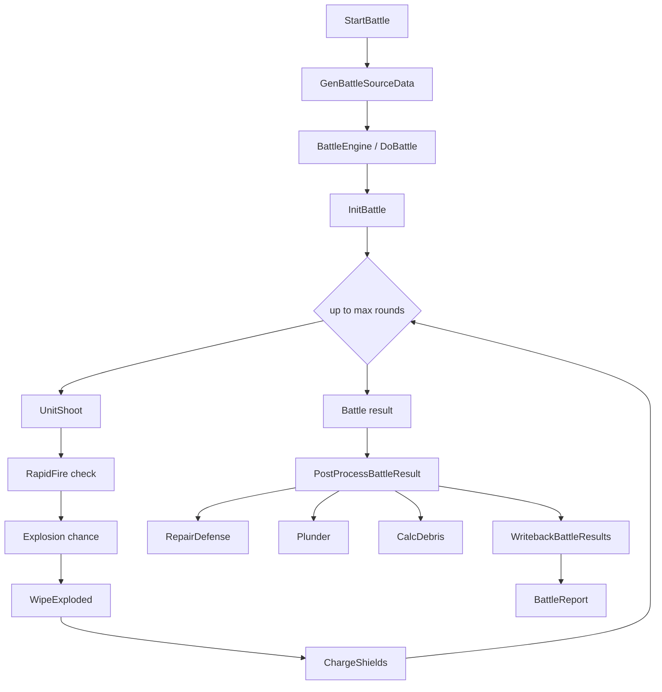

## Economy and Construction

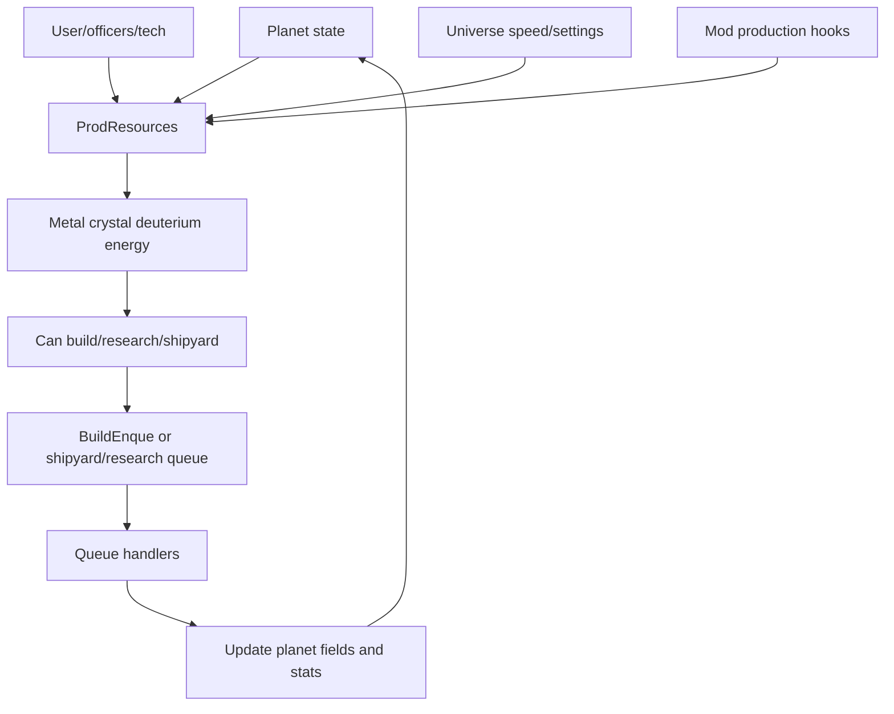

## Persistence

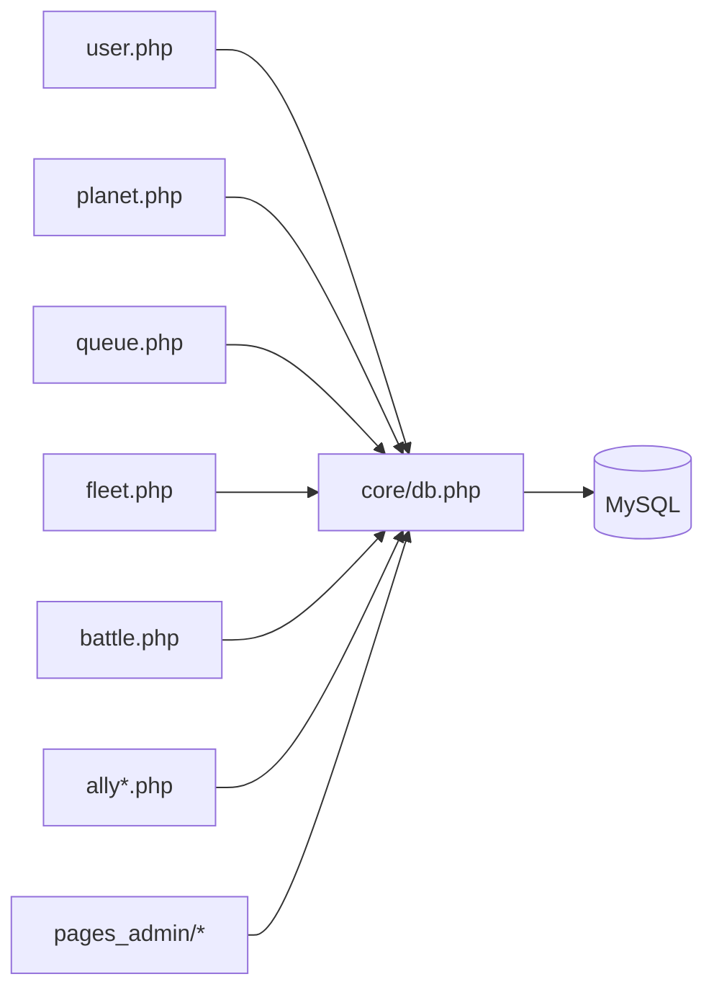

## Stellar RTS/4X/MMORPG Campaign Model

This optional design layer extends the OGame reference material with a fictional large-scale campaign structure: 12 acts, 50 chapters per act, 35 required detail elements per chapter, and 90 world-system classes. See [Stellar RTS/4X/MMORPG Campaign and Systems Blueprint](stellar-rts-4x-design.md) for the full 600-chapter grid and class table.

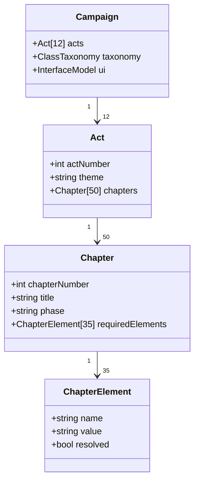

## 90-Class World-System Taxonomy

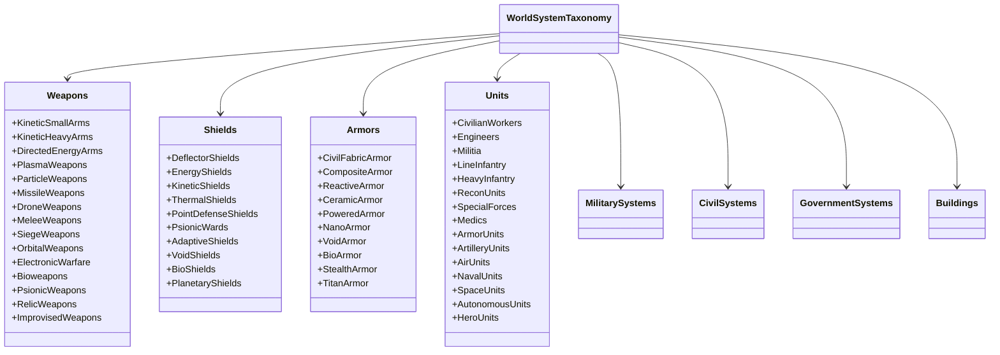

## Hybrid UI Interface

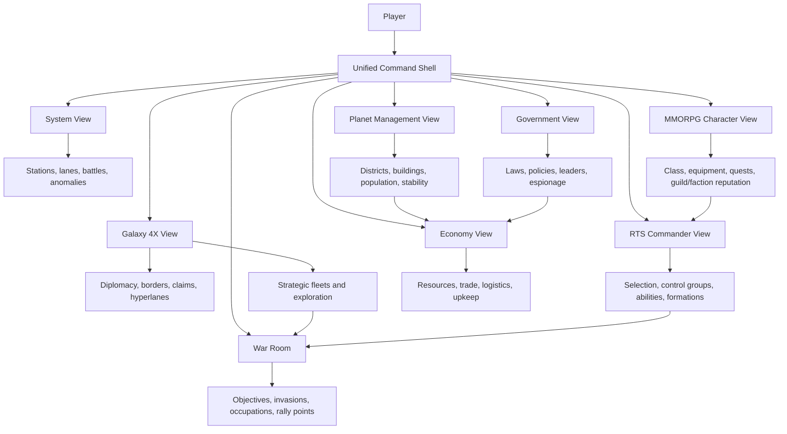

## UI State Machine

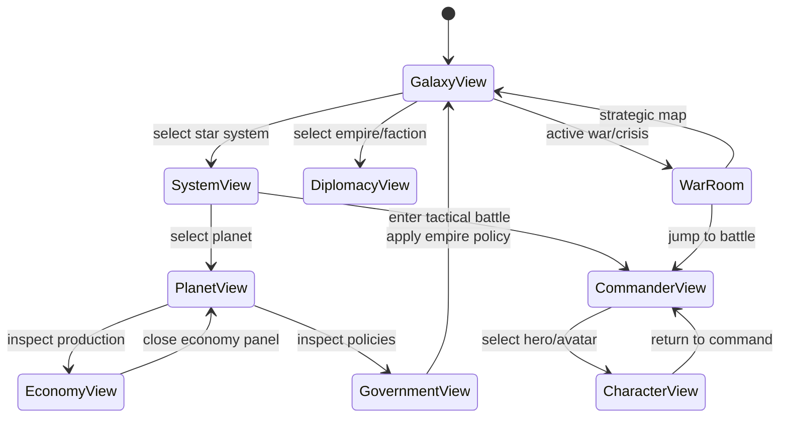

## OpenRA C# Scaffold Map

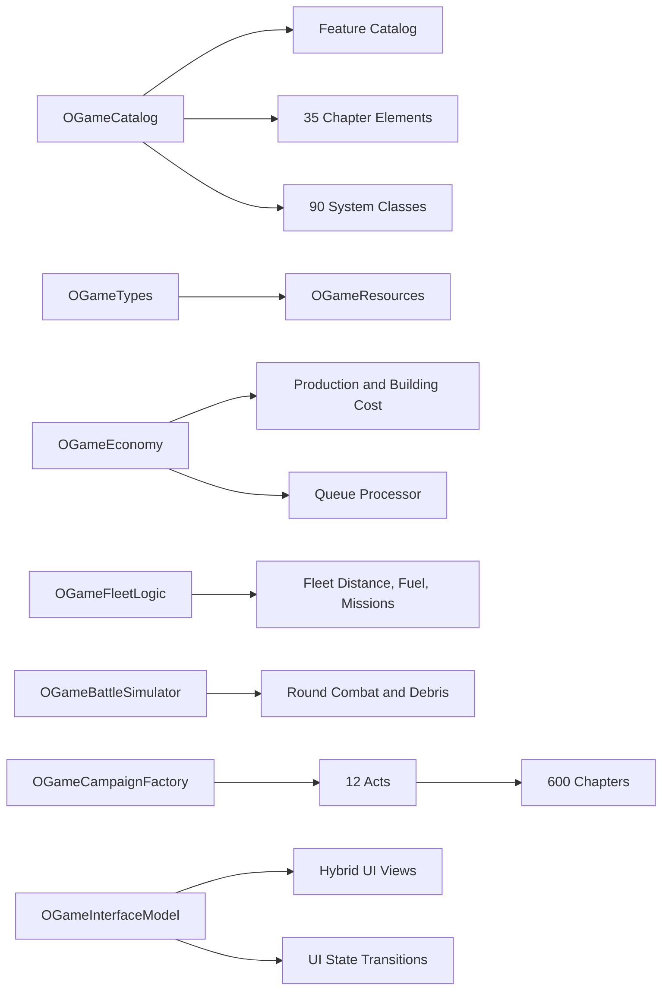
